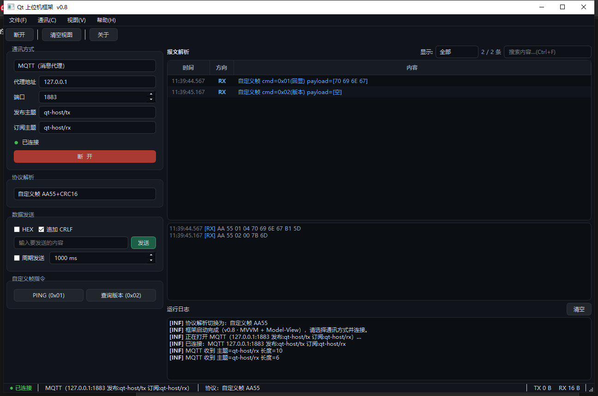

# Qt 上位机基础框架 v0.8（C++ / Qt Widgets · MVVM + Model-View）

一个分层清晰、可插拔扩展的上位机（Host Computer）框架工程。
v0.4 完成 **MVVM 分层重构**并生成 **Visual Studio 解决方案**（`vs-solution/QtHostFramework.slnx`，双击即可用 VS 2026 打开改代码）。
v0.5 把"报文解析"视图升级为真正的 **Qt Model-View 绑定**（`QAbstractTableModel` + `QTableView`，列：时间/方向/内容，按类型着色）。
v0.6 新增**方向过滤**（`QSortFilterProxyModel` 代理模型）、**右键复制菜单**（复制所选/复制全部/全选/清空）与**实时条数**（显示 N / M 条），过滤选择随 QSettings 记忆。
v0.7 新增**关键字搜索**（过滤条搜索框，内容列子串匹配、不区分大小写、可与方向过滤叠加；Ctrl+F 聚焦、Esc 清空）。
v0.8 新增 **MQTT 传输通道**（嵌入式行业常用的消息代理接入）：MQTT 3.1.1 / QoS0，**纯 Qt Network 实现，零第三方依赖**；代理地址、发布/订阅主题界面可配；订阅收到的载荷自动进入既有 协议解码→报文视图 链路，发送数据自动 PUBLISH 到发布主题。

- **Model**      ：`core/`（传输层 ITransport 六种实现 + 协议解码器 + AppLogger）+ `vm/PacketLogModel`（报文数据模型）+ `vm/PacketFilterProxy`（方向+关键字过滤代理模型）
- **ViewModel**  ：`vm/HostViewModel`（全部业务命令与可观察状态，不引用任何 UI 头文件）
- **View**       ：`ui/MainWindow`、`ui/ControlPanel`、`QTableView`（纯界面 + 信号绑定，零业务逻辑）

- 技术栈：C++17 + Qt Widgets + Qt SerialPort + Qt Network，兼容 Qt6 / Qt5
- 构建：CMake（≥ 3.16）；本机已验证 MSVC(v14.50) + Qt 6.8.3 编译运行通过
- 界面：中文，纯代码构建，深色主题 QSS



> 左：控制面板（已选 MQTT 通道，代理/端口/发布/订阅主题可配）；
> 右上：报文表格（2 条 RX 解码行，时间/方向/内容，按类型着色，支持过滤与搜索）；
> 右下：原始字节 + 运行日志。

---

## 一、功能一览

| 类别 | 内容 |
| --- | --- |
| 传输层（可插拔） | 串口 / TCP 客户端 / TCP 服务器 / UDP / 回环自测(虚拟短接) / **MQTT（消息代理）** |
| 协议层（可插拔） | 原始透传 / 自定义帧 AA55+CRC16 / **Modbus RTU** / **Modbus TCP** / 文本行 ASCII |
| 界面 | 菜单栏(文件/通讯/视图/帮助) + 工具栏 + 状态栏(状态/通道/协议/计数) |
| 报文视图 | **QTableView + PacketLogModel**，方向过滤(RX/TX/信息/警告/错误)、**关键字搜索(Ctrl+F/Esc)**、右键复制、实时条数 N/M |
| 视图 | 原始字节（HEX 彩色行）、运行日志（分级着色） |
| 快捷指令 | 自定义帧 PING/查版本；Modbus 读保持(0x03)/写单寄存器(0x06)，参数可调 |
| 自动化 | 周期自动发送（文本/HEX）；Modbus 自动轮询读（间隔可调，切换协议/断开自动停止） |
| 持久化 | 通讯方式/串口参数/TCP-UDP-MQTT 地址与主题/协议选择/HEX 选项/报文过滤 全部 QSettings 记忆 |
| 实用项 | HEX/文本发送、HEX 显示、报文导出 txt/log、收发字节计数、设备热拔插感知 |

**回环测试**：无硬件时选"回环测试"通道连接，写入的数据 80ms 后原样回传，
可完整演示 协议解析→报文视图 的整条链路（例如自定义帧 PING → 收到回显应答）。

**MQTT 接入**：选"MQTT（消息代理）"通道，填代理地址/端口与发布、订阅主题后连接。
订阅主题收到的 PUBLISH 载荷 = 通道原始字节，照常走 协议解码→报文视图；
"发送"数据则以 QoS0 PUBLISH 到发布主题。CONNACK 通过前连接不算成功，
空闲自动 PINGREQ 保活，运行日志记录每次主题收发。

---

## 二、架构与数据流

```
ControlPanel(人机交互)
     │ connectRequested / sendRequested / quickXxx
     ▼
HostViewModel（ViewModel：命令 slot + 状态 signal）
     │ openChannel / setProtocol / sendText / modbusXxx ...
     ▼
ITransport ── bytesReceived(原始字节) ──► 协议解码器(按选择)
  ├ SerialTransport                        ├ FrameCodec      (AA55+CRC16)
  ├ TcpClientTransport                     ├ ModbusRtuCodec  (CRC校验/功能码解析)
  ├ TcpServerTransport                     ├ ModbusTcpCodec  (MBAP 拆帧)
  ├ UdpTransport                           └ AsciiLineCodec  (按行拆包)
  ├ LoopbackTransport                                   │ packetParsed
  └ MqttTransport（CONNECT/SUBSCRIBE/                   ▼
    PINGREQ，PUBLISH 载荷→bytesReceived）   messageLine(kind, text) 信号
                                                        ▼
                                     PacketLogModel（QAbstractTableModel）
                                                        │ begin/endInsertRows
                                                        ▼
                                     PacketFilterProxy（QSortFilterProxyModel 方向+关键字过滤）
                                                        ▼
                                     QTableView（时间|方向|内容，按 kind 着色，右键复制）
```

依赖方向单向：`UI → VM → Core`；传输层与协议层互不认识，全部通过 ViewModel 装配。
**新增一种传输** = 实现 `ITransport`；**新增一种协议** = 写一个解码器类并接到
`HostViewModel::feedCodec`，UI/传输层零改动。

---

## 三、协议说明

- **自定义帧**：`AA 55 | CMD | LEN | PAYLOAD | CRC16-CCITT(大端)`，应答 CMD=`请求|0x80`；
  内置 `0x01` 回显、`0x02` 查询版本。CRC 覆盖 `CMD+LEN+PAYLOAD`（不含帧头 AA 55）。
- **Modbus RTU**：标准 ADU（从站+功能码+数据+CRC16/poly 0xA001，低字节在前）；
  解析支持 0x01~0x06 响应与异常帧（0x80|fn），自动 CRC 校验、粘包处理。
- **Modbus TCP**：标准 MBAP（事务号/协议号/长度/单元号），粘包按长度拆分。
- **文本行**：以 `\n`（可带 `\r`）结尾为一帧，半包自动缓冲。
- **MQTT**：3.1.1 协议最小客户端（CONNECT/CONNACK/SUBSCRIBE/SUBACK/PUBLISH/PINGREQ/
  PINGRESP/DISCONNECT），QoS0、CleanSession，剩余长度 varint 编解码、
  UTF-8 主题（2 字节大端长度前缀）均按规范实现。

## 四、如何扩展

**新增传输通道**（例：CAN、蓝牙串口）：

```cpp
class CanTransport : public ITransport {
    // 实现 open/close/isOpen/name/detail/write，
    // 收到数据时 emit bytesReceived(bytes) 即可
};
// 在 ControlPanel 加一个页 + HostViewModel::openChannel 加一个 case
```

**新增协议**（例：自定义二进制协议 X）：

```cpp
class XProtocolCodec : public QObject {
    Q_OBJECT
public:
    void feed(const QByteArray &bytes);   // 流式喂入，内部处理粘包/半包
signals:
    void packetParsed(const ParsedPacket &packet);
};
// 在 HostViewModel 中实例化、连接 packetParsed，并在 feedCodec() 加一个 case
```

## 五、构建与运行

### 方式 A：Visual Studio 直接打开（推荐日常开发）

双击 `vs-solution/QtHostFramework.slnx`（VS 2026 的新版解决方案格式）即可打开、改代码、
F7 编译。解决方案由 CMake 生成（发布压缩包内含现成版本；**本仓库为保持源码整洁未提交
生成物**），克隆后执行下面一行命令即可生成，之后添加/删除源文件改 `CMakeLists.txt`
再重新生成即可同步：

```bash
cmake -S . -B vs-solution -G "Visual Studio 18 2026" -A x64 -DCMAKE_PREFIX_PATH=C:/Qt/6.8.3/msvc2022_64
```

### 方式 B：CMake + Ninja 命令行

```bash
cmake -S . -B build -G Ninja -DCMAKE_BUILD_TYPE=Release -DCMAKE_PREFIX_PATH=C:/Qt/6.8.3/msvc2022_64
cmake --build build
run.bat        # 双击运行（自动设置 Qt DLL 路径）
```

其他环境：安装 Qt 6.x（含 SerialPort、Network 模块）+ CMake 后，用 Qt Creator 打开
`CMakeLists.txt` 即可；Qt5 也能直接编过。

## 六、目录结构（MVVM）

```
src/
├── main.cpp
├── core/                          【Model 层】
│   ├── ITransport.h               传输层抽象接口 ★扩展点
│   ├── transports/                串口/TCP客户端/TCP服务器/UDP/回环/MQTT
│   ├── protocols/                 Modbus RTU/TCP、ASCII行、消息结构 ★扩展点
│   ├── FrameCodec.{h,cpp}         自定义帧(AA55+CRC16)编解码
│   ├── MqttSettings.h             MQTT 连接参数（代理/端口/主题/keepalive）
│   ├── ByteUtils.h / AppLogger / SerialConfig
├── vm/                            【ViewModel 层】
│   ├── HostViewModel.{h,cpp}      全部业务命令(slot)与状态(signal)，不依赖 UI
│   ├── PacketLogModel.{h,cpp}     报文解析 QAbstractTableModel（数据源，按 kind 着色）
│   └── PacketFilterProxy.{h,cpp}  报文方向+关键字过滤 QSortFilterProxyModel
└── ui/                            【View 层】
    ├── MainWindow.{h,cpp}         菜单/主题/过滤条/右键菜单 + VM 绑定（无业务逻辑）
    ├── ControlPanel.{h,cpp}       连接配置+协议选择+发送+快捷指令（收集参数发命令）
    └── LogPanel.{h,cpp}           运行日志面板
```

## 七、常见问题

- **打不开串口**：确认没被其它串口助手占用；虚拟串口对工具需先创建端口对。
- **UDP 收不到**：目标端口要指向本机监听的端口；防火墙放行。
- **MQTT 连不上**：确认 broker 已启动、地址端口正确；需要用户名/密码的 broker
  暂在 `MqttSettings` 里填入后代码编译（界面暂未暴露该项）；public broker 请勿订阅大流量主题。
- **运行提示缺 DLL**：用 `run.bat` 启动（自动加 Qt bin 到 PATH），或用
  `windeployqt` 部署后再分发。
- **Modbus 无响应**：确认从站地址/寄存器地址与设备一致；RTU/TCP 协议要与通道匹配。
- **表格被过滤"看不到新行"**：检查过滤条是否选了"仅接收/仅发送"等；选"全部"即可。
